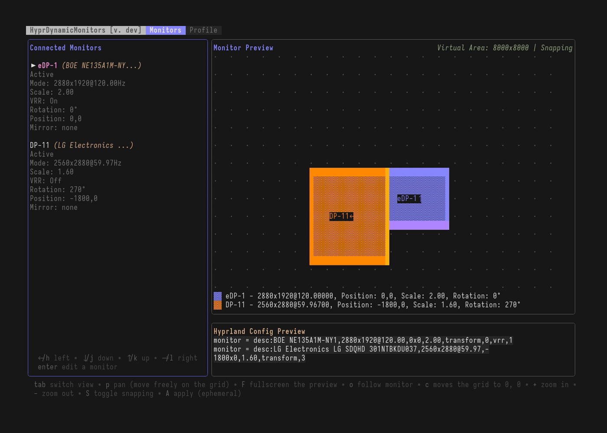

<H1>HyprDynamicMonitors</H1><br>


[](https://fiffeek.github.io/hyprdynamicmonitors/)


[](https://codecov.io/github/fiffeek/hyprdynamicmonitors)

An event-driven service with an interactive TUI that automatically manages Hyprland monitor configurations based on connected displays, power and lid state.


## Preview




<details>
<summary>Daemon Response to Power State Events</summary>


</details>

<details>
<summary>Daemon and TUI Response to Laptop Lid Events</summary>


</details>

## Table Of Contents

<!--ts-->
* [HyprDynamicMonitors](#hyprdynamicmonitors)
   * [Preview](#preview)
   * [Table Of Contents](#table-of-contents)
   * [Features](#features)
   * [Quick Start](#quick-start)
      * [Installation](#installation)
      * [Setup](#setup)
   * [Documentation](#documentation)
   * [Examples](#examples)
   * [Runtime Requirements](#runtime-requirements)
   * [Alternative Software](#alternative-software)
   * [Support](#support)
   * [License](#license)
<!--te-->

## Features

- **Event-driven architecture** responding to monitor, power and lid state changes in real-time
- **Interactive TUI** for visual monitor configuration and profile management
- **Profile-based configuration** with different settings for different monitor setups
- **Template support** for dynamic configuration generation
- **Hot reloading** automatically detects and applies configuration changes without restart (optional)
- **Power state awareness** built-in AC/battery detection for laptop users (optional)
- **Lid state awareness** built-in lid state detection for laptop users (optional)
- **Desktop notifications** for configuration changes (optional)

## Quick Start

### Installation

```bash
# Binary release (recommended)
export DESTDIR="$HOME/.local/bin"  # optional, defaults to ~/.local/bin/
curl -o- https://raw.githubusercontent.com/fiffeek/hyprdynamicmonitors/refs/heads/main/scripts/install.sh | bash

# AUR (Arch Linux)
$aurHelper -S hyprdynamicmonitors-bin

# Nix, for flakes/modules see: https://hyprdynamicmonitors.filipmikina.com/docs/advanced/systemd#nix
nix run github:fiffeek/hyprdynamicmonitors
```

See the [Installation Guide](https://fiffeek.github.io/hyprdynamicmonitors/docs/quickstart/installation) for more options.

### Setup

The easiest way to get started is using the TUI:

```bash
# Launch the interactive TUI
hyprdynamicmonitors tui

# Configure your monitors visually
# Press 'Tab' to switch to Profile view
# Press 'n' to create a new profile
```

Then add to your `~/.config/hypr/hyprland.conf`:

```conf
# Source the generated monitor configuration
source = ~/.config/hypr/monitors.conf

# Run the daemon for automatic profile switching
exec-once = hyprdynamicmonitors run
```

For detailed setup instructions, see the [Quick Start Guide](https://fiffeek.github.io/hyprdynamicmonitors/docs/category/quick-start).

> [!CAUTION]
> For production environments prefer running with `systemd` ([guide](https://fiffeek.github.io/hyprdynamicmonitors/docs/advanced/systemd)).

## Documentation

**Full documentation is available at [fiffeek.github.io/hyprdynamicmonitors](https://fiffeek.github.io/hyprdynamicmonitors/)**

Key topics:

| Topic | Description |
|-------|-------------|
| [Quick Start](https://fiffeek.github.io/hyprdynamicmonitors/docs/category/quick-start) | Get up and running quickly |
| [TUI Guide](https://fiffeek.github.io/hyprdynamicmonitors/docs/quickstart/tui) | Interactive monitor configuration |
| [Configuration](https://fiffeek.github.io/hyprdynamicmonitors/docs/category/configuration) | Profiles, monitors, and power management |
| [Templates](https://fiffeek.github.io/hyprdynamicmonitors/docs/advanced/templates) | Dynamic configuration generation |
| [Running with systemd](https://fiffeek.github.io/hyprdynamicmonitors/docs/advanced/systemd) | Production deployment |
| [CLI Commands](https://fiffeek.github.io/hyprdynamicmonitors/docs/usage/commands) | Command reference |
| [FAQ](https://fiffeek.github.io/hyprdynamicmonitors/docs/faq) | Common questions |
| [Power Events](https://fiffeek.github.io/hyprdynamicmonitors/docs/guides/power-events) | Guide to running with Power Events |
| [Lid Events](https://fiffeek.github.io/hyprdynamicmonitors/docs/guides/lid-events) | Guide to running with Lid Events |

## Examples

See the [`examples/`](https://github.com/fiffeek/hyprdynamicmonitors/tree/main/examples) directory for complete configuration examples:

| Example | Description |
|---------|-------------|
| [Basic Setup](https://github.com/fiffeek/hyprdynamicmonitors/tree/main/examples/basic) | Simple laptop configuration |
| [Full Configuration](https://github.com/fiffeek/hyprdynamicmonitors/tree/main/examples/full) | All available options |
| [Power States](https://github.com/fiffeek/hyprdynamicmonitors/tree/main/examples/power-states) | AC/battery-aware profiles |
| [Lid States](https://github.com/fiffeek/hyprdynamicmonitors/tree/main/examples/lid-states) | Laptop lid detection |
| [Template Variables](https://github.com/fiffeek/hyprdynamicmonitors/tree/main/examples/template-variables) | Dynamic templates |
| [Disable Monitors](https://github.com/fiffeek/hyprdynamicmonitors/tree/main/examples/disable-monitors) | Managing unexpected displays |

## Runtime Requirements

- Hyprland with IPC support
- UPower (required on laptops, unless `--disable-power-events` is passed, for power state monitoring)
- D-Bus access (required if power events, lid state or notifications are enabled)

## Alternative Software

Similar tools worth checking out:
- [kanshi](https://sr.ht/~emersion/kanshi/) - Generic Wayland output management
- [shikane](https://github.com/hw0lff/shikane) - Another Wayland output manager
- [nwg-displays](https://github.com/nwg-piotr/nwg-displays) - GUI-based display configuration tool
- [hyprmon](https://github.com/erans/hyprmon) - TUI-based display configuration tool

HyprDynamicMonitors is Hyprland-specific but offers deeper integration, an interactive TUI, template system, and power state awareness. See [Introduction](https://fiffeek.github.io/hyprdynamicmonitors/docs/) for a detailed comparison.

## Support

If you find HyprDynamicMonitors useful and want to support its development, consider buying me a coffee on [Ko-fi](https://ko-fi.com/filipmikina). Your support helps keep the project maintained and enables new features. Thank you!

## License

See [LICENSE](LICENSE) file.
