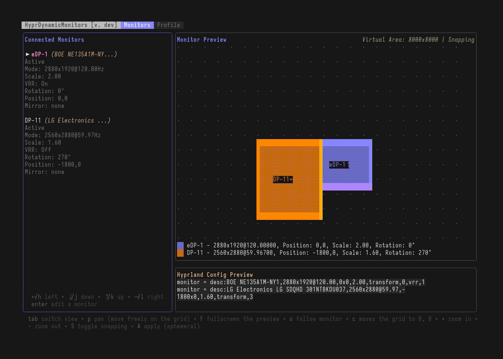

# TUI Documentation

The HyprDynamicMonitors TUI provides an interactive interface for managing Hyprland monitor configurations.

## Preview

## Views

The TUI has two main views that you can switch between using `Tab`:

1. **Monitors View** - Edit monitor layouts, positions, modes, and settings
2. **Profile View** - Manage HyprDynamicMonitors profiles and configuration

The profile view is available only when `--config` is a valid `hyprdynamicmonitors` configuration.
Otherwise you still might play with the monitors and apply the settings, but not save them under `hyprdynamicmonitors`.

## Global Keybinds

- `q` / `Ctrl+C` - Quit the TUI
- `Tab` - Switch between Monitors and Profile views

---

## Monitors View

The Monitors view shows connected monitors on the left and a visual preview on the right.

### Navigation

- `j` / `down` - Move down in the monitor list
- `k` / `up` - Move up in the monitor list
- `Enter` - Select a monitor for editing / Deselect when in editing mode

### Monitor Preview Controls

#### Panning Mode

- `p` - Toggle panning mode (move freely around the monitor grid)
- `h/j/k/l` or arrow keys - Pan the preview in panning mode
- `c` - Center the view back to origin (0,0)

#### Zoom

- `+` - Zoom in on the preview
- `-` - Zoom out on the preview

#### Display Options

- `F` - Toggle fullscreen preview mode
- `o` - Toggle follow monitor mode (preview auto-centers on selected monitor)
- `S` - Toggle snapping (when moving monitors, they snap to edges of other monitors)

### Editing a Monitor

Once you select a monitor with `Enter`, it enters **EDITING** mode. In this mode:

#### Position

- `h/j/k/l` or arrow keys - Move the monitor in 50px steps
  - With snapping enabled (default), monitors will snap to edges of other monitors within 50px
  - When snapping occurs, visual grid lines show the snap alignment

#### Rotation

- `r` - Rotate the monitor by 90 degrees (cycles through 0 -> 90 -> 180 -> 270 -> 0)
  - Cannot rotate disabled monitors

#### Resolution and Refresh Rate

- `m` - Open mode selection menu
  - Shows all available modes for the selected monitor
  - `j/k` - Preview different modes (updates preview in real-time)
  - `Enter` - Apply the selected mode
  - `Esc` - Close (applying the last selection)

#### Scaling

- `s` - Open scale selector
  - `k` - Increase scale by 0.1
  - `j` - Decrease scale by 0.1
  - `Enter` - Confirm scale change
  - `Esc` - Close (applying the last selection)

#### Mirroring

- `i` - Open mirror selection menu
  - Select which monitor this monitor should mirror
  - `j/k` - Navigate through available monitors to mirror
  - `Enter` - Apply mirror setting
  - `Esc` - Close (applying the last selection)
  - Mirror loops are prevented automatically

#### Enable/Disable

- `e` - Toggle monitor (e)nabled/disabled
  - Disabled monitors show as `disable` in the config preview
  - Cannot disable the last remaining monitor
  - Cannot edit settings of disabled monitors

#### Variable Refresh Rate (VRR)

- `v` - Toggle VRR on/off for the monitor

#### Color Profiles Management

- `C` - Enter color profiles management menu
  - `Esc/Enter` - Back / Select
  - `up/down` - Change the current color preset
  - `b` - Toggle bitdepth (at the moment only `default` and `10` is supported)
  - When `hdr` color profile is selected you can use `r/R` and `t/T` to adjust the SDR brightness and saturation

Due to [`hyprctl` not yet supporting the output of these](https://github.com/fiffeek/hyprdynamicmonitors/issues/34),
when you change the color preset and apply it, then reload the TUI,
the color preset will mismatch and show `auto/default/srgb`.
This will change as soon as the underlying issue in `Hyprland` is resolved.

### Applying Changes

- `A` - Apply current monitor configuration to Hyprland (ephemeral, not persisted on disk)
  - Shows confirmation prompt
  - `Y` - Confirm and apply
  - `N` or `Esc` - Cancel

---

## Profile View

The Profile view shows your HyprDynamicMonitors configuration and lets you save monitor layouts as profiles.

### Profile Management

#### Creating a New Profile

- `n` - Create new profile from current monitor layout
  - Opens profile name input
  - Type the profile name
  - `Enter` - Save the profile
  - `Esc` - Cancel

The profile will include:
- All connected monitors as required monitors (matched by description)
- Current monitor layout, modes, scales, positions, and settings

#### Editing an Existing Profile

When the current monitors match an existing profile:

- `a` - Apply edited settings to the matching profile
  - Shows confirmation prompt with profile name
  - `Y` - Confirm and update the profile
  - `N` or `Esc` - Cancel
  - After confirmation, the config is reloaded automatically
- `e` - Edit the config file in your `$EDITOR`

### Profile Status Indicators

The TUI shows different status messages:

- **Profile: [name]** - Current monitors match this profile exactly
- **Monitor Count Mismatch** - Monitors match partially but count differs
- **No Matching Profile** - No profile matches current monitor setup

### Configuration

- `C` - Open the HyprDynamicMonitors config file in your default editor (defined by `$EDITOR`)

---

## Tips

1. **Snapping**: Keep snapping enabled (default) for easier monitor alignment. When snapping is active, monitors automatically align to edges of other monitors within 50px.

2. **Follow Mode**: Enable f(o)llow mode (`o`) when moving monitors to keep them centered in the preview.

3. **Fullscreen Preview**: Use fullscreen mode (`F`) to get a better view when working with many monitors or complex layouts.

4. **Preview Before Applying**: All changes are shown in the preview immediately. You can experiment freely without affecting your actual configuration until you press `A` to apply **and confirm**.

5. **Profile Workflow**:
   - Arrange monitors in the Monitors view
   - Switch to Profile view with `Tab`
   - Create a new profile with `n` or update existing with `a`
   - The profile will be saved to your HyprDynamicMonitors config

6. **Panning**: Use panning mode (`p`) to explore large monitor layouts. The grid shows spacing dots that scale with zoom level.

---

## Visual Indicators

### Monitor List

- `>` - Currently selected item in the list
- `[EDITING]` - Monitor is in editing mode
- `[CHANGE MODE]` - Mode selection menu is open
- `[SCALE MODE]` - Scale selector is open
- `[MIRRORING]` - Mirror selection menu is open

### Monitor Preview

- Monitors are shown as colored rectangles on a grid
- The selected monitor has a different fill pattern
- Monitor labels show the name and an arrow indicating rotation
- Bottom edge is highlighted with a brighter color to show orientation
- Snap lines appear as vertical `|` and horizontal `-` lines when snapping occurs

### Status Messages

Success messages appear in the header and automatically clear after 2 seconds.
Errors linger forever (until cleared by any other success).
